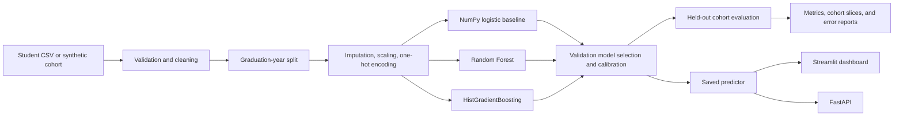

# Placement predictor architecture

## Data flow

1. `graduation_year` orders records for a chronological 70/15/15 train, validation, and test split; it is excluded from model features.
2. Imputation, scaling, and one-hot encoding are fit on training rows only.
3. The custom logistic-regression baseline and library models share the same preprocessing and frozen test cohort.
4. Validation metrics select the final model and fit the calibration layer. Test rows are used only for final reporting.
5. The predictor returns a readiness probability, confidence, and readiness category. The dashboard also reports profile signals against transparent guidance thresholds; those signals are not causal explanations or guarantees.
