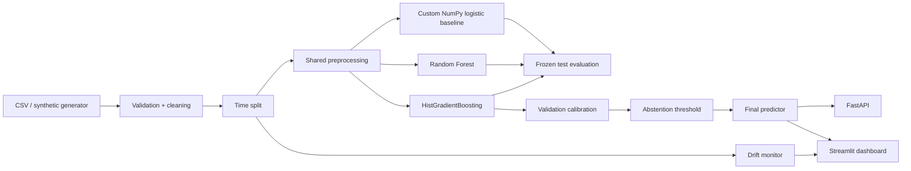

# ShiftProof architecture

## Data flow

1. Input rows are parsed and normalised.
2. The dataset is ordered by request timestamp.
3. Train/validation/test are separated chronologically.
4. Imputation, scaling and one-hot encoding are fit only on training data.
5. Three models are trained on the same processed training data.
6. Validation predictions choose the final model and fit calibration.
7. A confidence threshold is selected on validation data.
8. Test metrics remain frozen and are used only for evidence.
9. The API/dashboard use the saved final bundle.
10. Drift compares a new batch against the training distribution.
